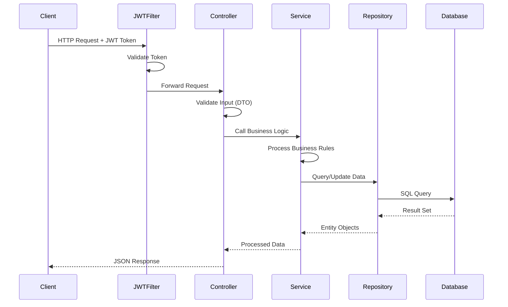
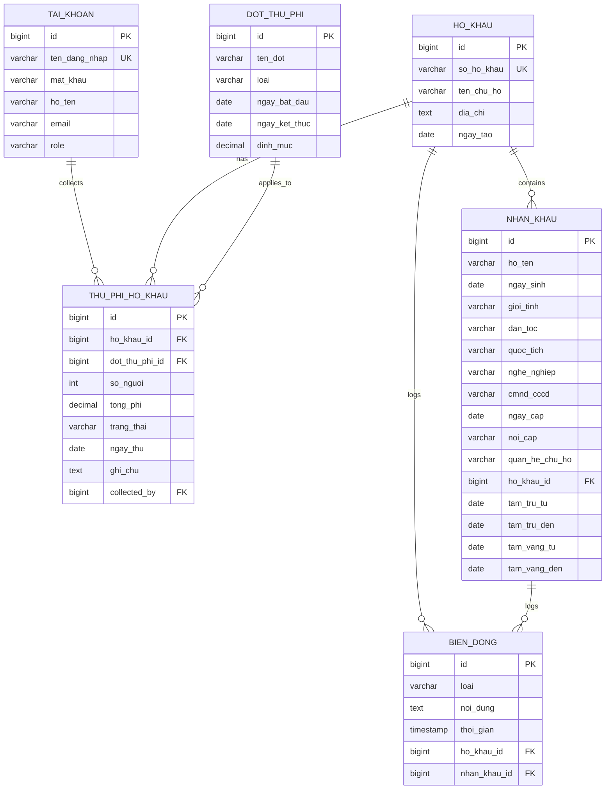
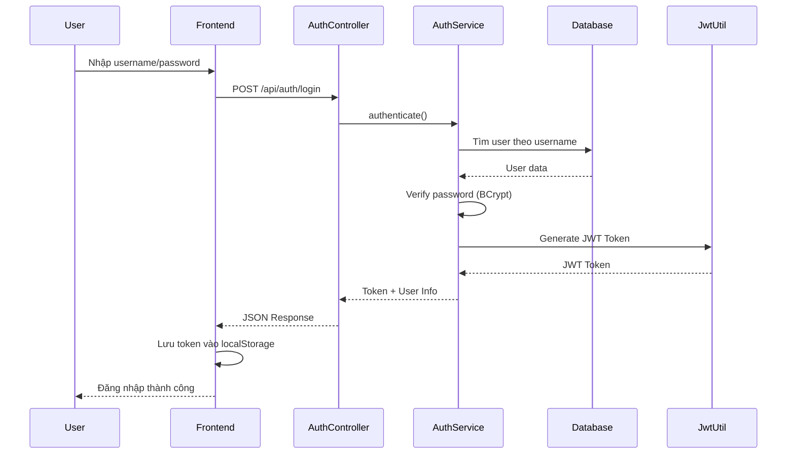
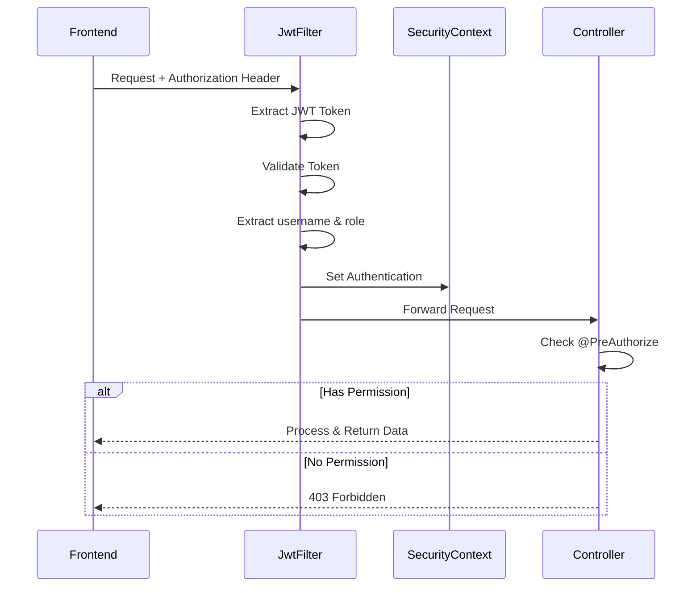
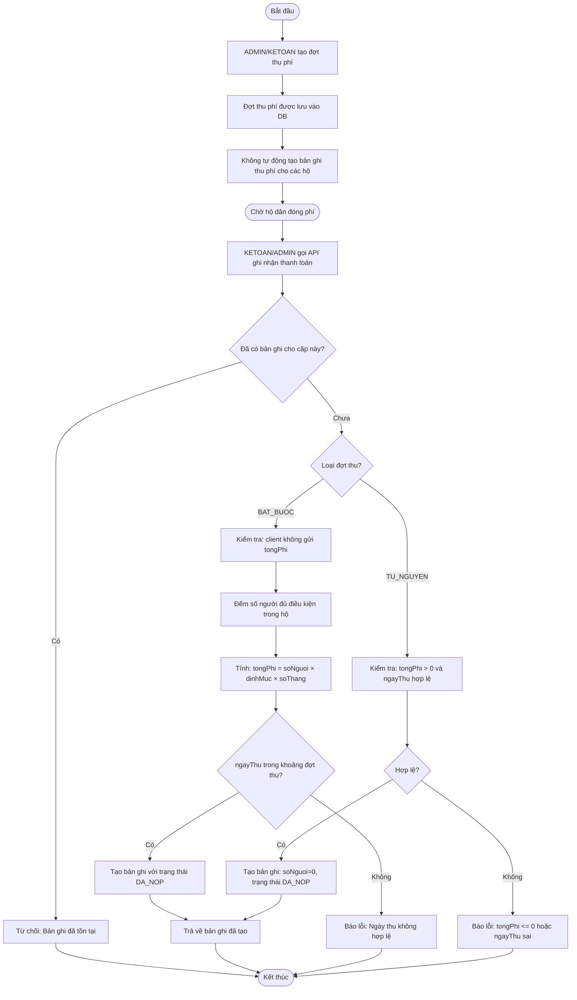
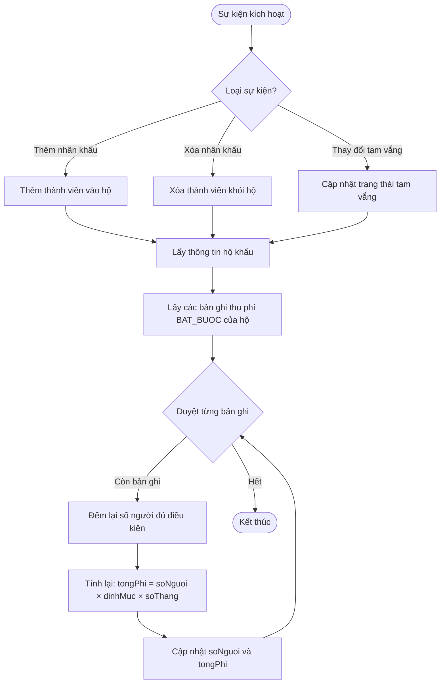

# Kiến Trúc Hệ Thống - Quản Lý Dân Cư

> **Đồ án Công Nghệ Phần Mềm**  
> Phiên bản: 1.0  
> Cập nhật: Tháng 11/2024

---

## Mục Lục

1. [Tổng Quan Hệ Thống](#1-tổng-quan-hệ-thống)
2. [Công Nghệ Sử Dụng](#2-công-nghệ-sử-dụng)
3. [Kiến Trúc Phân Tầng](#3-kiến-trúc-phân-tầng)
4. [Sơ Đồ Kiến Trúc](#4-sơ-đồ-kiến-trúc)
5. [Thiết Kế Cơ Sở Dữ Liệu](#5-thiết-kế-cơ-sở-dữ-liệu)
6. [Cơ Chế Bảo Mật](#6-cơ-chế-bảo-mật)
7. [Quy Trình Nghiệp Vụ](#7-quy-trình-nghiệp-vụ)
8. [Các Mẫu Thiết Kế](#8-các-mẫu-thiết-kế)

---

## 1. Tổng Quan Hệ Thống

### 1.1 Giới Thiệu

Hệ thống Quản Lý Dân Cư là một ứng dụng web RESTful được xây dựng để hỗ trợ quản lý thông tin dân cư và thu phí tại khu dân cư. Hệ thống tuân thủ kiến trúc phân tầng (layered architecture) với sự tách biệt rõ ràng giữa các thành phần.

### 1.2 Mục Tiêu Thiết Kế

- **Tính mô-đun cao**: Mỗi tầng có trách nhiệm riêng biệt
- **Dễ bảo trì**: Code được tổ chức có cấu trúc, dễ hiểu
- **Bảo mật**: Xác thực JWT và phân quyền dựa trên vai trò
- **Khả năng mở rộng**: Dễ dàng thêm chức năng mới
- **Hiệu suất**: Tối ưu hóa truy vấn database và xử lý logic

### 1.3 Đặc Điểm Chính

- RESTful API với định dạng JSON
- Xác thực không trạng thái (stateless) sử dụng JWT
- Phân quyền dựa trên vai trò (Role-Based Access Control)
- Tự động validation dữ liệu đầu vào
- Xử lý lỗi tập trung
- Hỗ trợ CORS cho frontend

---

## 2. Công Nghệ Sử Dụng

### 2.1 Backend Framework

| Công nghệ | Phiên bản | Mục đích |
|-----------|-----------|----------|
| Spring Boot | 3.3.5 | Framework chính cho backend |
| Spring Web | 3.3.5 | Xây dựng RESTful API |
| Spring Data JPA | 3.3.5 | Truy xuất cơ sở dữ liệu |
| Spring Security | 3.3.5 | Xác thực và phân quyền |
| Hibernate | 6.x | ORM (Object-Relational Mapping) |

### 2.2 Database

| Công nghệ | Mục đích |
|-----------|----------|
| PostgreSQL | Cơ sở dữ liệu quan hệ chính |
| HikariCP | Connection pool |

### 2.3 Bảo Mật

| Công nghệ | Mục đích |
|-----------|----------|
| JWT (JSON Web Token) | Xác thực không trạng thái |
| BCrypt | Mã hóa mật khẩu |

### 2.4 Công Cụ Phát Triển

| Công nghệ | Mục đích |
|-----------|----------|
| Maven | Quản lý dependencies và build |
| Lombok | Giảm boilerplate code |
| Jackson | JSON serialization/deserialization |
| Jakarta Validation | Validation dữ liệu đầu vào |

---

## 3. Kiến Trúc Phân Tầng

Hệ thống tuân theo kiến trúc 4 tầng:

### 3.1 Presentation Layer (Tầng Trình Diễn)

**Trách nhiệm:**
- Nhận HTTP requests từ client
- Validation dữ liệu đầu vào cơ bản
- Chuyển đổi request thành lời gọi service
- Trả về HTTP responses

**Thành phần:**
- Controllers (AuthController, NhanKhauController, HoKhauController, v.v.)
- DTO (Data Transfer Objects)
- Exception Handlers

**Đặc điểm:**
- Sử dụng annotation `@RestController`
- Áp dụng `@PreAuthorize` cho phân quyền
- Validation với `@Valid`

---

### 3.2 Service Layer (Tầng Nghiệp Vụ)

**Trách nhiệm:**
- Xử lý logic nghiệp vụ phức tạp
- Điều phối giao dịch (transaction management)
- Kết hợp dữ liệu từ nhiều repositories
- Thực hiện các phép tính và validation phức tạp

**Thành phần:**
- AuthService: Xử lý đăng ký, đăng nhập
- HoKhauService: Logic quản lý hộ khẩu
- ThuPhiHoKhauService: **Tầng nghiệp vụ phức tạp nhất** - xử lý tính toán phí, thanh toán, tự động cập nhật trạng thái

**Đặc điểm:**
- Sử dụng annotation `@Service`
- Quản lý transaction với `@Transactional`
- Độc lập với cơ chế truyền tải (HTTP, messaging, v.v.)

---

### 3.3 Repository Layer (Tầng Truy Xuất Dữ Liệu)

**Trách nhiệm:**
- Truy xuất và thao tác dữ liệu trong database
- Cung cấp các phương thức CRUD cơ bản
- Thực thi các truy vấn tùy chỉnh

**Thành phần:**
- HoKhauRepository
- NhanKhauRepository
- DotThuPhiRepository
- ThuPhiHoKhauRepository
- TaiKhoanRepository

**Đặc điểm:**
- Extends `JpaRepository<Entity, ID>`
- Tự động sinh các phương thức CRUD
- Hỗ trợ query methods và `@Query` annotation

---

### 3.4 Domain Layer (Tầng Miền)

**Trách nhiệm:**
- Định nghĩa cấu trúc dữ liệu
- Mapping giữa object và database tables
- Định nghĩa quan hệ giữa các entities

**Thành phần:**
- Entity classes (HoKhau, NhanKhau, DotThuPhi, ThuPhiHoKhau, TaiKhoan)
- Enums (Role, LoaiThuPhi)

**Đặc điểm:**
- Sử dụng JPA annotations (`@Entity`, `@Table`, `@Column`)
- Định nghĩa relationships (`@ManyToOne`, `@OneToMany`)
- Lombok để giảm boilerplate code

---

## 4. Sơ Đồ Kiến Trúc

### 4.1 Sơ Đồ Thành Phần Tổng Quan

```mermaid
graph TB

%% ===== Client =====
    subgraph ClientLayer["Client Layer"]
        Client[React Frontend]
    end

%% ===== Backend =====
    subgraph BackendLayer["Backend System"]

    %% Security
        subgraph SecurityLayer["Security"]
            JWTFilter[JWT Filter]
            SpringSecurity[Spring Security]
        end

    %% Presentation
        subgraph PresentationLayer["Presentation Layer"]
            AuthC[Auth Controller]
            NhanKhauC[NhanKhau Controller]
            HoKhauC[HoKhau Controller]
            DotThuPhiC[DotThuPhi Controller]
            ThuPhiC[ThuPhiHoKhau Controller]
            TaiKhoanC[TaiKhoan Controller]
        end

    %% Service
        subgraph ServiceLayer["Service Layer"]
            AuthS[Auth Service]
            HoKhauS[HoKhau Service]
            ThuPhiS[ThuPhiHoKhau Service]
        end

    %% Repository
        subgraph RepositoryLayer["Repository Layer"]
            HoKhauR[HoKhau Repository]
            NhanKhauR[NhanKhau Repository]
            DotThuPhiR[DotThuPhi Repository]
            ThuPhiR[ThuPhiHoKhau Repository]
            TaiKhoanR[TaiKhoan Repository]
        end

    %% Entities
        subgraph DomainLayer["Domain Layer"]
            HoKhauE[HoKhau Entity]
            NhanKhauE[NhanKhau Entity]
            DotThuPhiE[DotThuPhi Entity]
            ThuPhiE[ThuPhiHoKhau Entity]
            TaiKhoanE[TaiKhoan Entity]
        end

    end

%% ===== Database =====
    subgraph Database["Database"]
        PostgreSQL[(PostgreSQL)]
    end

%% ===== Edges =====

    Client -->|HTTP/JSON| JWTFilter
    JWTFilter --> SpringSecurity
    SpringSecurity --> PresentationLayer

    PresentationLayer --> ServiceLayer
    ServiceLayer --> RepositoryLayer
    RepositoryLayer --> DomainLayer
    DomainLayer --> PostgreSQL
```



### 4.2 Luồng Xử Lý Request



---

## 5. Thiết Kế Cơ Sở Dữ Liệu

### 5.1 Sơ Đồ ERD

> **Lưu ý v2:** Mọi cột audit (`created_at`, `updated_at`, `created_by`) đã được loại bỏ. Sơ đồ dưới đây phản ánh schema hiện tại.



### 5.2 Mô Tả Các Bảng Chính

**tai_khoan (Tài Khoản)**
- Lưu trữ thông tin người dùng hệ thống
- Mật khẩu được mã hóa BCrypt
- Role: ADMIN, TOTRUONG, KETOAN

**ho_khau (Hộ Khẩu)**
- Lưu trữ thông tin hộ gia đình
- `so_ho_khau` là định danh duy nhất, không thể sửa sau khi tạo
- Số thành viên được tính động từ `nhan_khau` (không lưu trữ cột riêng)

**nhan_khau (Nhân Khẩu)**
- Lưu trữ thông tin công dân
- Liên kết với `ho_khau` qua foreign key
- Hỗ trợ tạm trú, tạm vắng qua các cặp ngày (`tam_tru_tu/den`, `tam_vang_tu/den`)
- Trạng thái (`THUONG_TRU`, `TAM_TRU`, `TAM_VANG`) được dẫn xuất khi trả về DTO

**dot_thu_phi (Đợt Thu Phí)**
- Định nghĩa các kỳ thu phí
- Phân biệt `BAT_BUOC` và `TU_NGUYEN`
- Lưu định mức và khoảng thời gian

**thu_phi_ho_khau (Thu Phí Hộ Khẩu)**
- Ghi nhận thanh toán đầy đủ của từng hộ cho mỗi đợt (một bản ghi duy nhất cho mỗi cặp `hoKhauId, dotThuPhiId`)
- Chỉ lưu trạng thái `DA_NOP`; `CHUA_NOP` là trạng thái ảo khi chưa có bản ghi
- Tự động tính `soNguoi` và `tongPhi` cho đợt bắt buộc

**bien_dong (Biến Động)**
- Nhật ký văn bản ghi lại các thay đổi nhân khẩu/hộ khẩu
- Loại biến động: `CHUYEN_DEN`, `CHUYEN_DI`, `TACH_HO`, `NHAP_HO`, `SINH`, `KHAI_TU`, `THAY_DOI_THONG_TIN`, `TAM_TRU`, `HUY_TAM_TRU`, `TAM_VANG`, `HUY_TAM_VANG`
- Không có tác dụng phụ tự động; các service tự gọi nhau khi cần

---

## 6. Cơ Chế Bảo Mật

### 6.1 Quy Trình Xác Thực



### 6.2 Quy Trình Phân Quyền



### 6.3 Cấu Hình CORS

Hệ thống cho phép cross-origin requests từ:
- `http://localhost:3000` (React dev server)
- `http://localhost:5173` (Vite dev server)

Các methods được phép: GET, POST, PUT, DELETE, OPTIONS

---

## 7. Quy Trình Nghiệp Vụ

### 7.1 Quy Trình Thu Phí (v2)

> **Lưu ý:** Phiên bản v2 đơn giản hóa quy trình—chỉ có **một bản ghi** `thu_phi_ho_khau` cho mỗi cặp `(hoKhauId, dotThuPhiId)`. Bảng chỉ lưu trạng thái `DA_NOP`; `CHUA_NOP` là trạng thái ảo khi chưa tồn tại bản ghi.



**Điểm khác biệt so với v1:**
- Không tự động tạo bản ghi `thu_phi_ho_khau` khi tạo đợt thu phí.
- Không có khái niệm thanh toán nhiều lần hay tổng tiền đã thu.
- Công thức: `tongPhi = soNguoi × dinhMuc × soThang` (với `soThang` tính từ `ngayBatDau` đến `ngayKetThuc`, bao gồm cả hai đầu mút).
- `ngayThu` luôn bắt buộc và phải nằm trong khoảng thời gian của đợt thu.
- Đợt tự nguyện: `soNguoi = 0`, `tongPhi` do client cung cấp và phải > 0.

### 7.2 Quy Trình Tự Động Tính Lại Phí

> Khi số lượng thành viên hộ khẩu thay đổi (thêm/xóa nhân khẩu, cập nhật tạm vắng), hệ thống tính lại `soNguoi` và `tongPhi` cho các bản ghi bắt buộc đã tồn tại. Trạng thái `DA_NOP` không thay đổi.



**Lưu ý:**
- Chỉ tính lại cho các bản ghi `BAT_BUOC` đã tồn tại.
- Đợt `TU_NGUYEN` không bị ảnh hưởng vì `soNguoi = 0` và `tongPhi` do người dùng nhập.
- Trạng thái bản ghi (`DA_NOP`) không thay đổi sau khi tính lại.
```

---

## 8. Các Mẫu Thiết Kế

### 8.1 Layered Architecture (Kiến Trúc Phân Tầng)

- Tách biệt rõ ràng: Presentation → Service → Repository → Domain
- Dependency flow: từ trên xuống dưới
- Mỗi tầng có trách nhiệm riêng biệt

### 8.2 Dependency Injection (Tiêm Phụ Thuộc)

- Spring IoC container quản lý các beans
- Sử dụng `@Autowired` cho constructor injection
- Giảm coupling giữa các components

### 8.3 DTO Pattern (Data Transfer Object)

- Tách biệt entity và data transfer layer
- Validation tại DTO level
- Ngăn chặn over-fetching/under-fetching

### 8.4 Repository Pattern

- Abstract hóa data access logic
- JpaRepository cung cấp CRUD operations
- Custom queries với method naming hoặc @Query

### 8.5 Service Facade Pattern

- Service layer đóng vai trò facade
- Che giấu complexity của business logic
- Điều phối nhiều repository calls

### 8.6 Filter Pattern

- JwtFilter chặn mọi requests
- Validate authentication trước khi vào controller
- Implements OncePerRequestFilter

---

## Kết Luận

Hệ thống Quản Lý Dân Cư được xây dựng trên kiến trúc phân tầng rõ ràng, tuân thủ các nguyên tắc SOLID và các mẫu thiết kế chuẩn. Việc tách biệt các tầng giúp hệ thống dễ bảo trì, mở rộng và kiểm thử. Cơ chế bảo mật JWT kết hợp với phân quyền dựa trên vai trò đảm bảo tính an toàn của dữ liệu. Thiết kế database được tối ưu với các ràng buộc và quan hệ phù hợp, hỗ trợ tốt cho nghiệp vụ tính toán phí tự động và ghi nhận thanh toán đơn giản (một bản ghi cho mỗi hộ và đợt thu).

---

**Hết tài liệu Kiến Trúc Hệ Thống**
